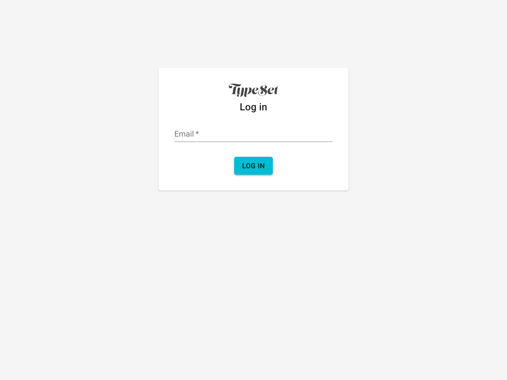
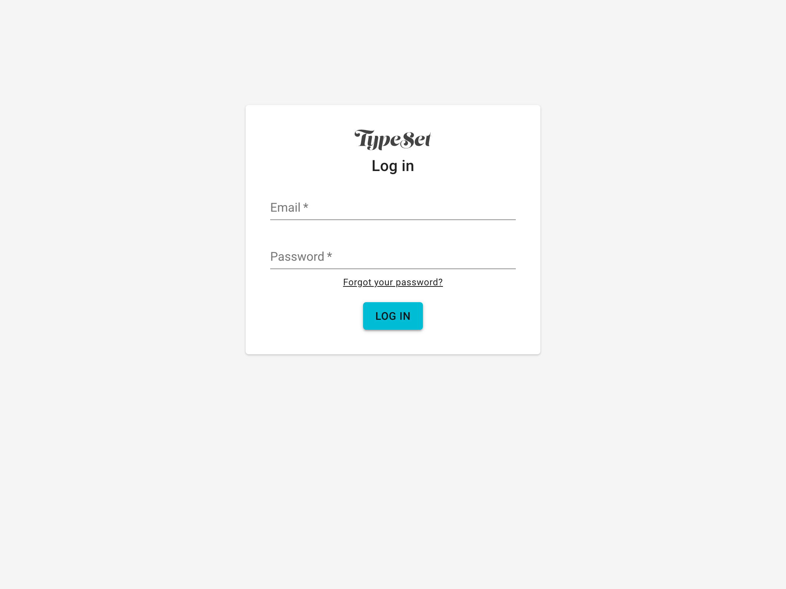
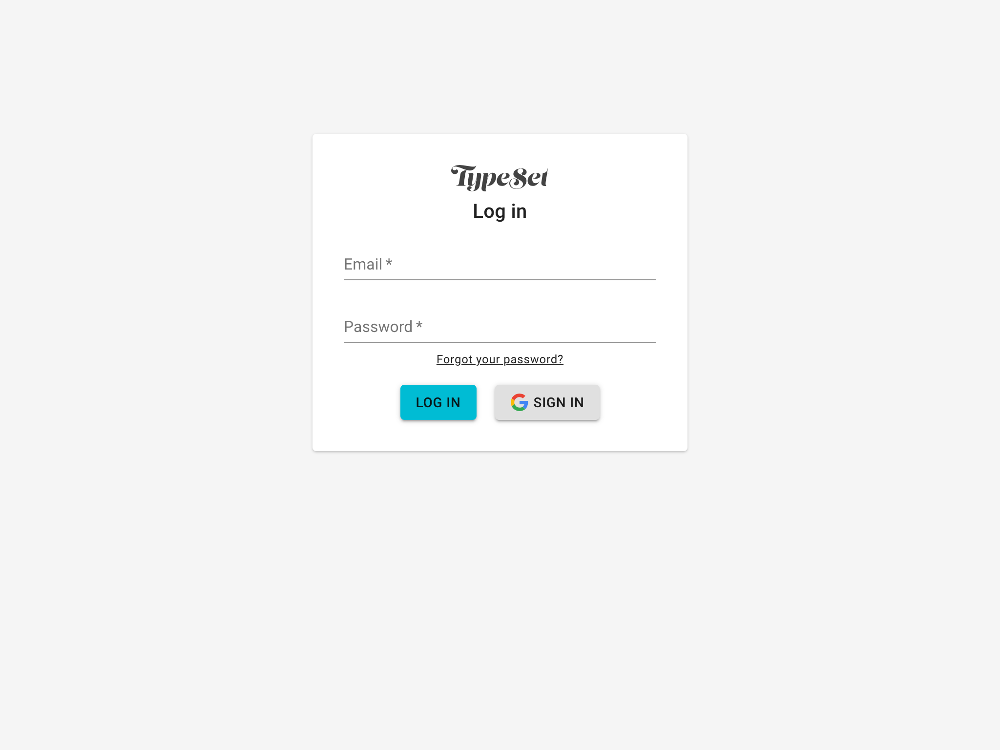
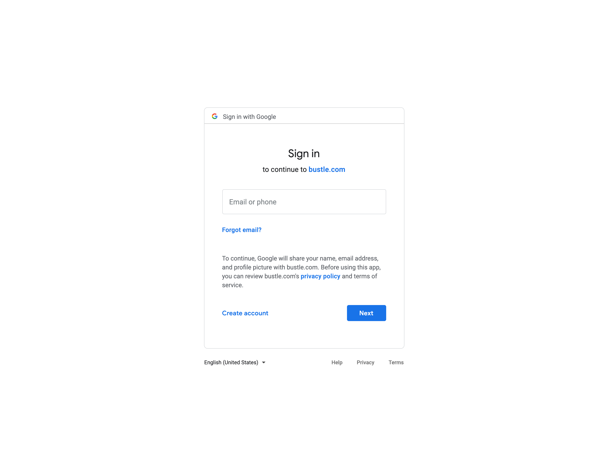
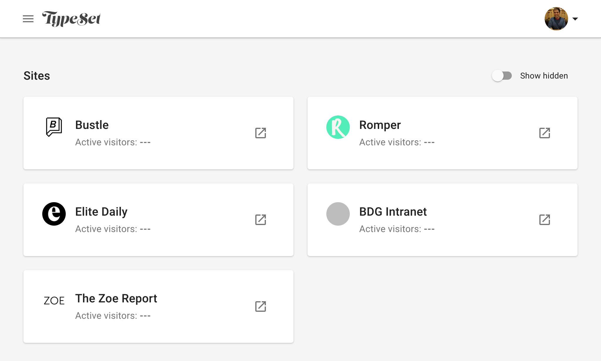

# Oh Auth too?


---

# Auth is proving who you are


^ Ask someone who they are

---



---

# Passwords: a shared secret

^ make someone write a password down, then ask them who they are and then their password

---



^ ask someone else to login as anuj

---

# oAuth2: someone vouches for you


---
# oAuth2: someone writes you a "grant"

---

# Example Grant

```js
{
  name,
  signature
}
```
---

# Example Grant

```js
{
  name: "Ice Abuadas",
  signature: "Dalia Abuadas"
}
```

^ Have someone vouch for someone and write it down, have them "login"
^ have someone else copy the grant and login

---

# CRYPTO HELP


^ public/private key signing of the grant
^ have someone sign their name on the grant

---

# Possession is 10/9ths of the wild wild web


^ have someone else steal the grant and login
^ have someone else login to the wrong site

---
# oAuth2

```js
const grant = {
  name: "Millie",
  signature: "Zach Foster",
  for: "Francis's website"
}

const code = sha256(grant)
// 17EED0653B985999187A
```

^ I trust zach and we have a secure way to talk and trust each other
^ and millie logs in and she asks Zach for the code and gives it to me
^ I give it to zach - if it checks out he gives me the grant

---



---



---
# https://cms.bustle.com/login?code=XXXXXX

---

```
{
  mutation ($code: String!) {
    googleOAuth(input: {code: $code }) {
      authToken
    }
  }
}
```

---

```js
const googleOAuth = async code => {
  const tokenSet = await getOAuthToken(code)
  const { email } = await fetchGoogleProfile(tokenSet)
  const user = await graph.User.FINDBY('email', email.toLowerCase())
  return generateLoginToken(user)
}
```

---



---

# oAuth2

- protects grants from eavesdropping
- protects grants from forgery
- protects users from phishing

^ Grants given to the server not the user

---

 

^ thanks!
